# Robust and non-robust features of MNIST dataset

Constructing the robust dataset according to the approach suggested by [Ilyas et al.](https://arxiv.org/abs/1905.02175):

Ilyas, Andrew, et al. *"Adversarial examples are not bugs, they are features."* arXiv preprint arXiv:1905.02175 (2019).

I have extract robust/nonrobust features for all 60k samples in the training set. The original MNIST dataset can be found [here](http://yann.lecun.com/exdb/mnist/).

## Usage

Clone the repo and import `load_feature.py`. Call the corresponding functions.

## Perturbations

Four types of perturbations:
- Vertical lines
- Horizontal lines
- Gaissian noise
- Removal

The last group is not modified.

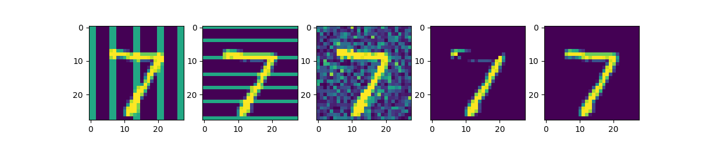

| Group Id | STD Training (CNN) Accuracy | Robust Training Accuracy|
|:---:|:---:|:---:|
|1| 0.829 | 0.968 |
|2| 0.549 | 0.967 |
|3| 0.808 | 0.969 |
|4| 0.727 | 0.950 |
|5| 0.977 | 0.972 |

Running STD training over reconstructed datasets:

| Group Id | Robust Dataset Accuracy | Nonrobust Dataset Accuracy|
|:---:|:---:|:---:|
|1| 0.792 | 0.856 |
|2| 0.822 | 0.434 |
|3| 0.908 | 0.865 |
|4| 0.876 | 0.657 |
|5| 0.960 | 0.954 |

## Reconstruction

|Original|Reconstruction (Robust)|Reconstruction (Nonrobust)|
|:---:|:---:|:---:|
|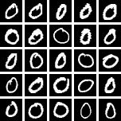|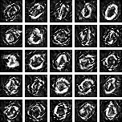|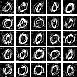|
|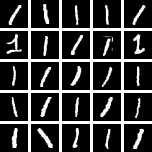|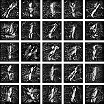|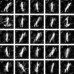|
|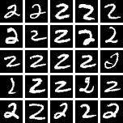||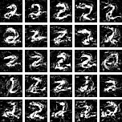|
|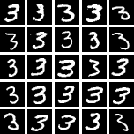|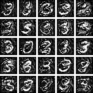|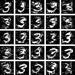|
|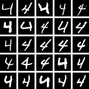|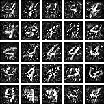|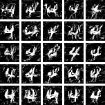|
|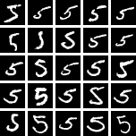|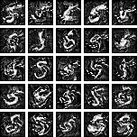|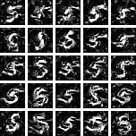|
|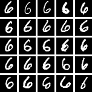|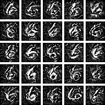||
||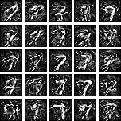|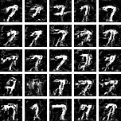|
|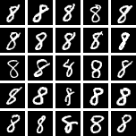|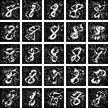|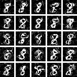|
|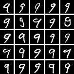|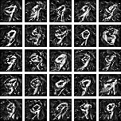|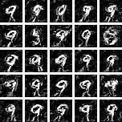|